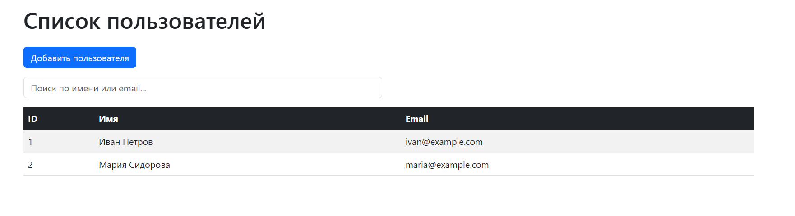
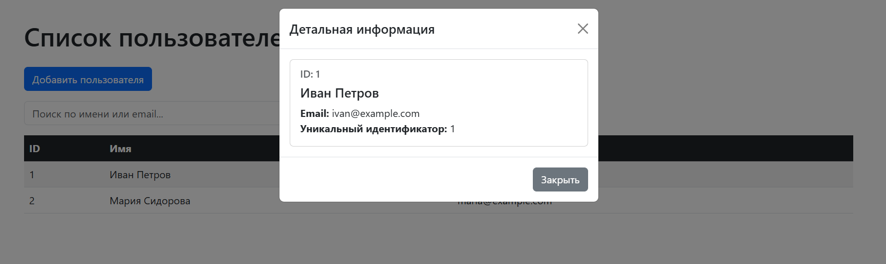
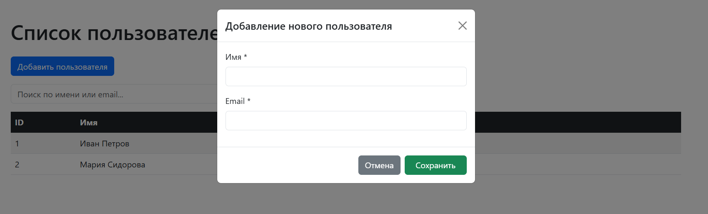
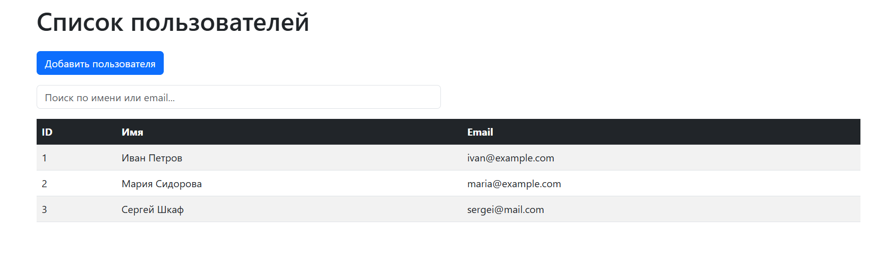
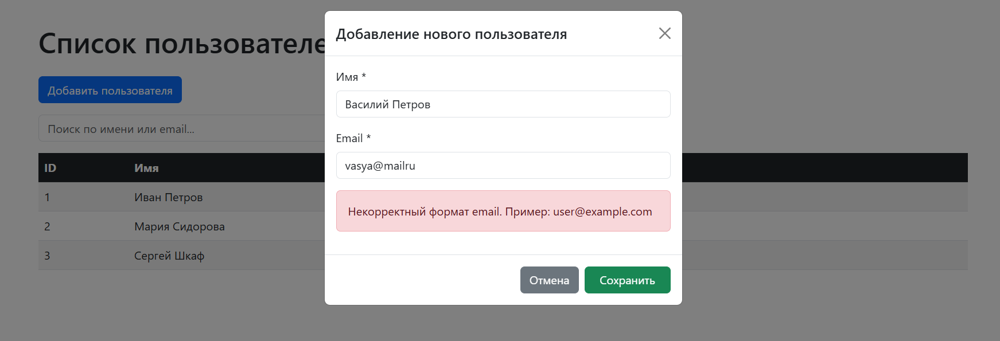
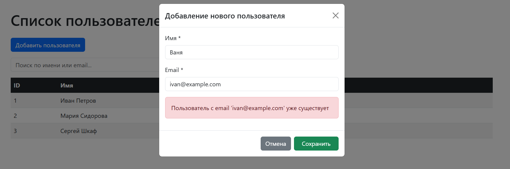
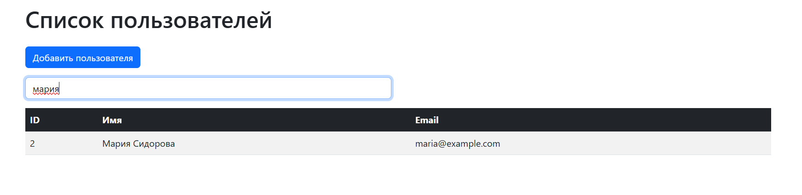
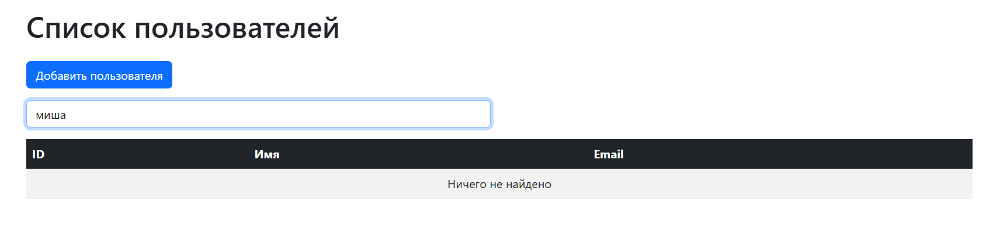
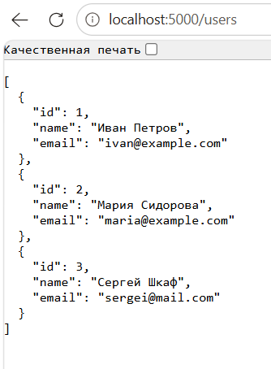
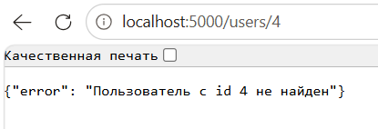

# Fullstack test

Тестовое задание: веб-приложение для управления пользователями с бэкендом на Flask и фронтендом на vanilla JavaScript.

---

## Структура проекта

```
fullstack_test/
├── backend/
│   ├── app.py              # Flask приложение
│   └── requirements.txt    # Зависимости Python
├── frontend/
│   └── index.html          # Фронтенд (Bootstrap + vanilla JS)
└── README.md               # Эта инструкция
```
---

## Быстрый старт

### Установка зависимостей
```bash
cd backend
pip install -r requirements.txt
```
---

### Запуск бэкенда

#### Открыть терминал в папке `backend`

```bash
cd backend
```

#### Создать виртуальное окружение
```bash
Windows:
python -m venv venv
venv\Scripts\activate
```
```bash
Mac / Linux:
python3 -m venv venv
source venv/bin/activate
```
---

#### Запустить сервер
```bash
python app.py
```
---

### Запуск фронтенда

Открыть файл frontend/index.html

### Остановка приложения
Бэкенд: нажмите Ctrl + C в терминале, где запущен Flask.

Фронтенд: просто закройте вкладку браузера.

### Примечания
Бэкенд проверен flake8 и black — соответствует PEP 8.

Валидация email на фронте и бэкенде.

### Скриншоты работы 

Главная страница с таблицей


Модальное окно с деталями пользователя



Форма добавления пользователя (открытая)


Успешное добавление пользователя


Ошибка валидации на фронте


Ошибка 409 (email уже существует)


Поиск/фильтрация по таблице


Пустой результат поиска


Ответ API в браузере (JSON)



Ошибка 404 (пользователь не найден)


